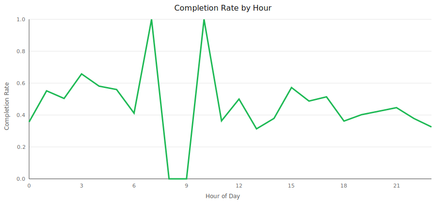
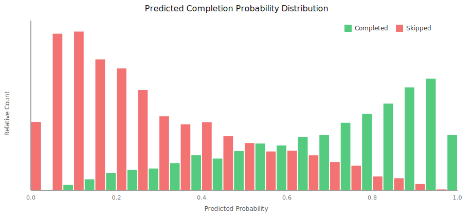
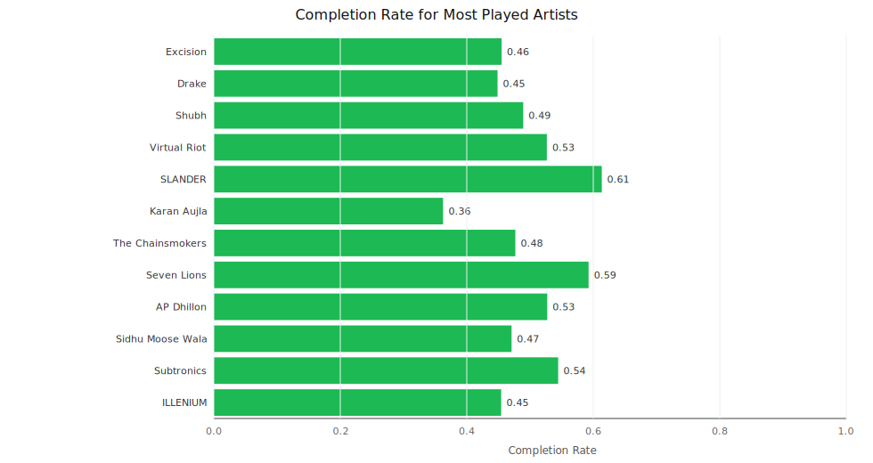
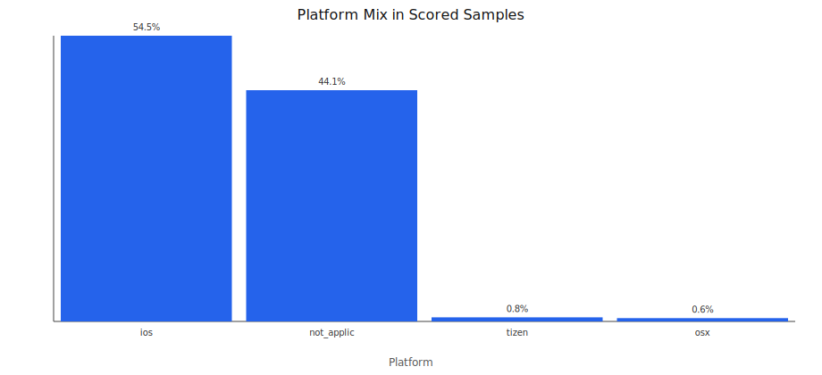

# Spotify Recommender

A session-aware recommendation pipeline built from Spotify export data.

## Problem
Given user listening events, estimate the probability that a track play will complete (not be skipped), then rank candidate tracks by expected completion to create recommendation-ready outputs.

## Why This Project
- Uses multiple Spotify export modalities together: account profile, long-horizon streaming history, and technical logs.
- Applies chronological evaluation instead of random split to better reflect real deployment behavior.
- Produces interpretable artifacts for product and modeling discussions.

## System Design
1. Ingest data from three export sources.
2. Build temporal/session features (hour, day, session position, recent skip rate).
3. Add behavioral priors (track/artist skip rates from train window only).
4. Merge daily technical reliability signals (connection/playback errors).
5. Train logistic regression (NumPy implementation) on chronological train split.
6. Score plays and generate top-ranked recommendation candidates.

## Key Features
- Time: `hour`, `day_of_week`, `month`, `is_weekend`
- Session: `session_position`, `recent_skip_rate_10`
- Behavior priors: `track_train_skip_rate`, `artist_train_skip_rate`, play counts
- Context: `platform`, `conn_country`, `reason_start`, `reason_end`
- Reliability: `connection_error_count`, `playback_error_count`

## Outputs (Local Only)
The pipeline writes these to `outputs/` (ignored in git):
- `model_metrics.json`
- `feature_importance.csv`
- `top_resume_playlist.csv`
- `scored_samples.csv`
- `resume_project_summary.md`
- `model_comparison.csv` and `model_comparison.json`
- `RESULTS.md` (summary of classification + ranking metrics)
- `figures/*.svg`, `figures/dashboard.html`, and `figures/visualization_summary.md`

## Visual Diagnostics

### 1) Completion Rate by Hour

**Takeaway:** Completion probability varies by time-of-day, indicating that temporal context is a meaningful recommendation feature.

### 2) Prediction Score Distribution (Completed vs Skipped)

**Takeaway:** The model assigns higher completion probabilities to completed plays than skipped plays, showing good class separation.

### 3) Completion Rate for Most Played Artists

**Takeaway:** Artist-level behavior is strongly differentiated, supporting the use of artist priors in ranking.

### 4) Platform Mix

**Takeaway:** Listening context is platform-dependent, which justifies platform features in completion prediction.

## Run
```bash
cd spotify-recommender
python3 src/pipeline.py \
  --account-dir "../Spotify Account Data" \
  --extended-dir "../Spotify Extended Streaming History" \
  --tech-dir "../Spotify Technical Log Information" \
  --output-dir "./outputs"
```

## Visualize
```bash
cd spotify-recommender
python3 src/visualize.py \
  --scored-samples "./outputs/scored_samples.csv" \
  --out-dir "./outputs/figures"
```

## Repo Structure
- `src/pipeline.py`: full training + scoring + recommendation pipeline
- `run_pipeline.sh`: convenience runner
- `requirements.txt`: dependencies

## Privacy and Security
This public repository excludes all personal Spotify export files and generated personal model outputs.
